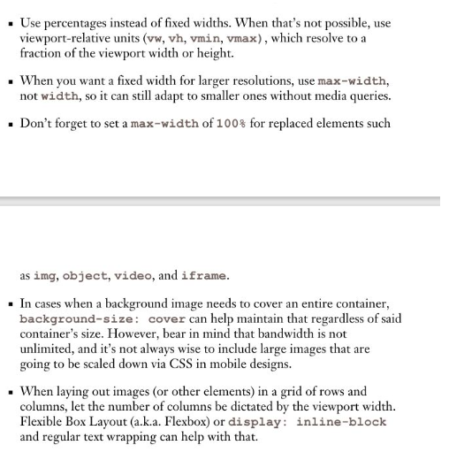
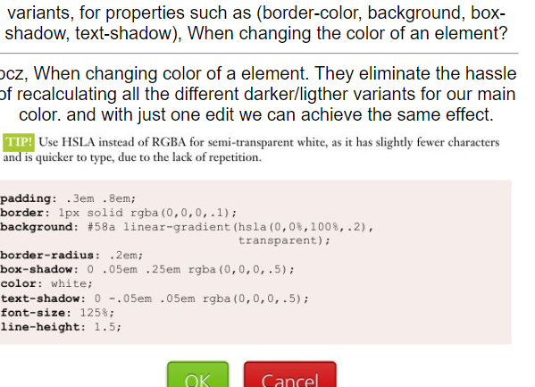

# i need to do js projects from the link below `Deadline: 1 project before 10/Sept`
https://javascript30.com/
Inside of project-004 or JS-project-100 repository

# Checkpoint
At this point you should be able to add interactivity to your web pages using JavaScript. You should make sure that you have learnt the following:

* Use JavaScript to make HTTP requests to external APIs (i.e. fetch)
* Use JavaScript to store data in the browser's local storage
# Here are few ideas to practice your skills:

* Create a simple to-do list app that allows users to search, add, edit, and delete items. Use local storage to store the data.
* Create a simple webpage where user can put in anyone's GitHub username and see their profile information. You can use GitHub's API to fetch the data. For example, here is the sample URL to fetch my data. Make sure to add validation and error handling.
* Create a basic calculator app that allows users to perform basic arithmetic operations.

Some tips to keep in mind for creating liquid layouts and relative sizing between media-queries break-points?

